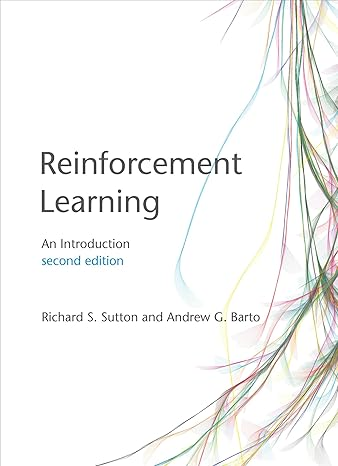
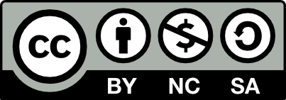

# Introduction to Reinforcement Learning

__Under development!__

The course material follows the 
popular textbook:

> Richard S. Sutton, Andrew G. Barto,
> [_Reinforcement Learning: An Introduction,_](http://incompleteideas.net/book/the-book.html) 
> 2nd edition, MIT Press, Cambridge, MA, 2018.

## Content

| Module | Book Chapter | Lecture Slides | Code |
| :----- | :----------- | :------------: | :--: |
| 1 | 1: Introduction | PDF , [PowerPoint](https://mhahsler.github.io/Introduction_to_Reinforcement_Learning/slides/Lecture01.pptx) | - | 
| 2 | 3: Finite Markov Decision Processes | PDF , [PowerPoint](https://mhahsler.github.io/Introduction_to_Reinforcement_Learning/slides/Lecture02.pptx) | - | 
| 3 | 4: Dynamic Programming | PDF , [PowerPoint](https://mhahsler.github.io/Introduction_to_Reinforcement_Learning/slides/Lecture03.pptx) | - | 
| 4 | 5: Monte Carlo Methods | PDF , [PowerPoint](https://mhahsler.github.io/Introduction_to_Reinforcement_Learning/slides/Lecture04.pptx) | - | 
|  |  TODO | | - | 
| 5 | 4: Temporal-Difference Learning | PDF , [PowerPoint](https://mhahsler.github.io/Introduction_to_Reinforcement_Learning/slides/Lecture.pptx) | - | 
| 6 | 9-10: On-policy Prediction and Control using Approximation | PDF , [PowerPoint](https://mhahsler.github.io/Introduction_to_Reinforcement_Learning/slides/Lecture.pptx) | - | 
| 7 | 12: Eligibility Traces | PDF , [PowerPoint](https://mhahsler.github.io/Introduction_to_Reinforcement_Learning/slides/Lecture.pptx) | - | 
| 9 | 13: Policy Gradient Methods | PDF , [PowerPoint](https://mhahsler.github.io/Introduction_to_Reinforcement_Learning/slides/Lecture.pptx) | - | 
| 10 | X: Deep Reinforcement Learning | PDF , [PowerPoint](https://mhahsler.github.io/Introduction_to_Reinforcement_Learning/slides/Lecture.pptx) | - | 
| 11 | X: Current Applications | PDF , [PowerPoint](https://mhahsler.github.io/Introduction_to_Reinforcement_Learning/slides/Lecture.pptx) | - | 

## License

Introduction to Reinforcement Learning &copy; 2025 Michael Hahsler and others is licensed under [CC BY-NC-SA 4.0](https://creativecommons.org/licenses/by-nc-sa/4.0/).

For questions please contact [Michael Hahsler](http://michael.hahsler.net).
